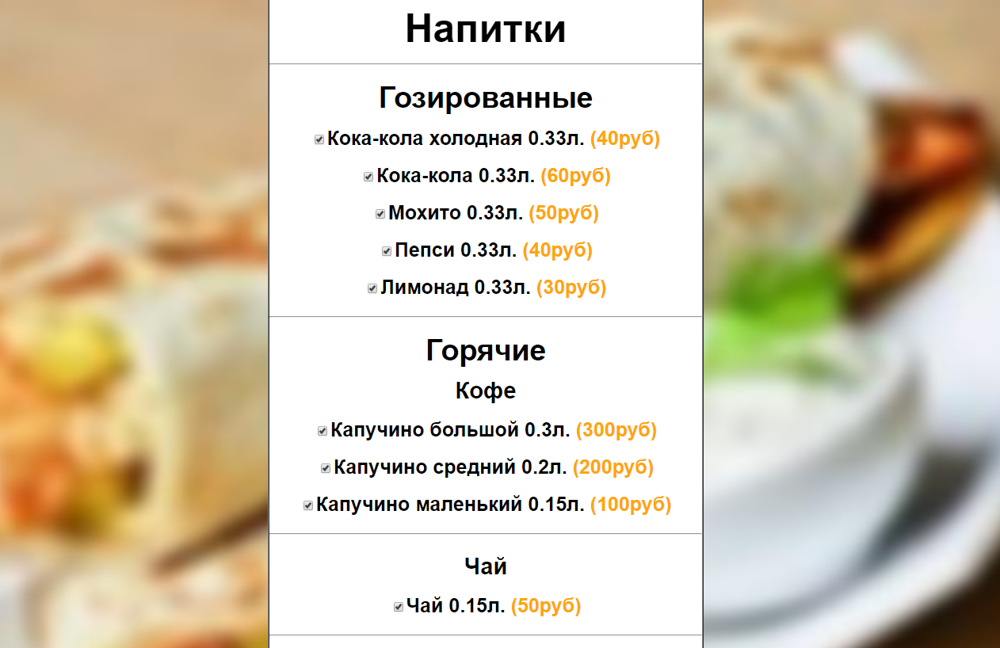
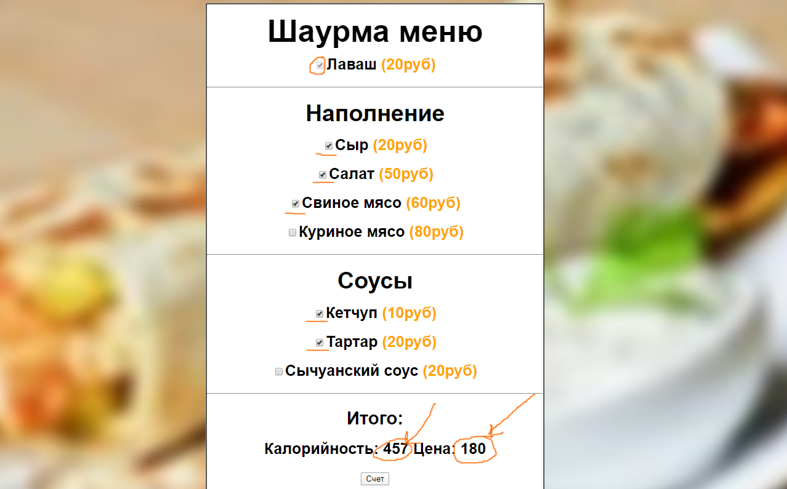

# Игра "Меню"

## 🌯 Купи свою шаурму.

В разделе шаурмы будет <b>несколько подразделов</b> например: <b>соусы</b>, <b>наполнение</b> и т.д.

Вы можете выбрать ингридеенты, после чего нажать на кнопку и получить цену за вашу шаурму и количество колорий, содиржащихся в ней.

## 🍺 Запей

Потом вы можете купить напиток или несколько напитков. Разделы тоже есть.

Принцып колорий и цены тот же, что и с шаурмой.

## Ближайшие обновления

### Меню

* Напитки
* Ингридеенты

### Подсчет

* Количество колорий
* Подсчёт стоимости заказа.

## Благодарности

* Исходный код на YouTube: https://www.youtube.com/watch?v=PjmMIngDj0c&list=PLM7wFzahDYnG-oMkclNX0FIcLZR18hFDM&index=5

## Созданное мной

* Новое меню
* CSS стили
* Подсчёт стоимости напитков
* Весь раздел <b>"Ближайшие обновления"</b>

## Скриншоты и объяснения 🤳🏻

## Пример напитков:

## Покупка:

Вы можете увидеть, что лаваш выделен серой галачкой, потому что он обязателен. Он стоит <b>20 рублей</b>

Допустим, вы выбрали сыр за <b>20 рублей</b>, салат за <b>50 рублей</b>, свиное мясо за <b>60 рублей</b>, а из соусов тартар за <b>20 руб</b> и кетчуп за <b>10 рублей.</b>

<b>Итого: 20 + 20 + 50 + 60 + 20 + 10 = 180 руб.</b>

Далее вы просто нажимает на кнопку <b>"Счет"</b> и вам показывают количество колорий, параметры, которых вы можете найти в коде и цену шавермы, которую мы посчитали раньше.

